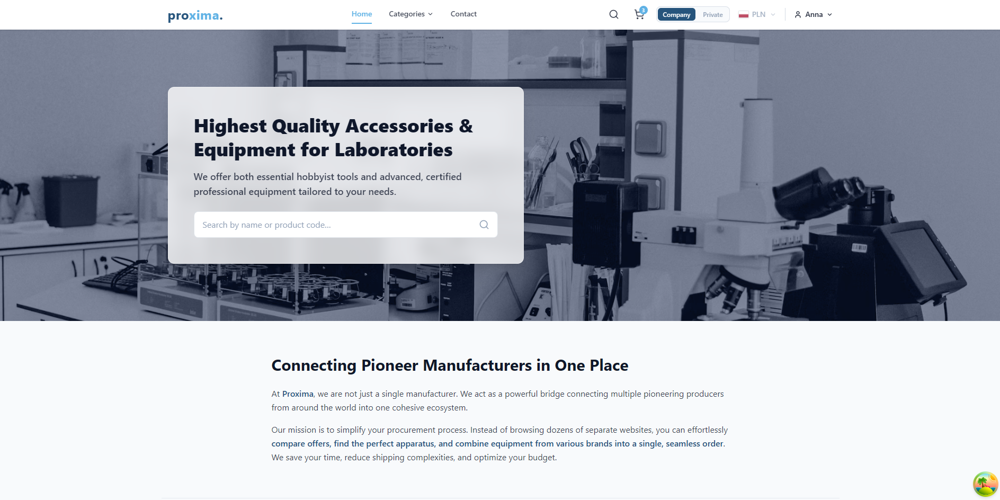
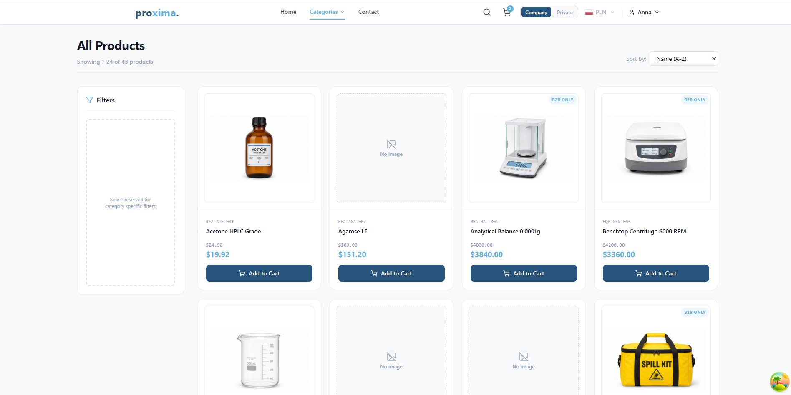
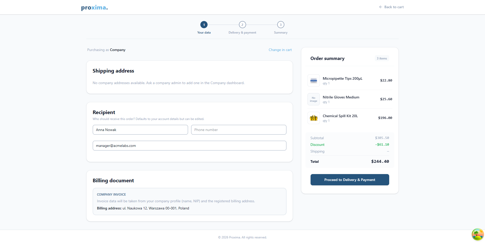
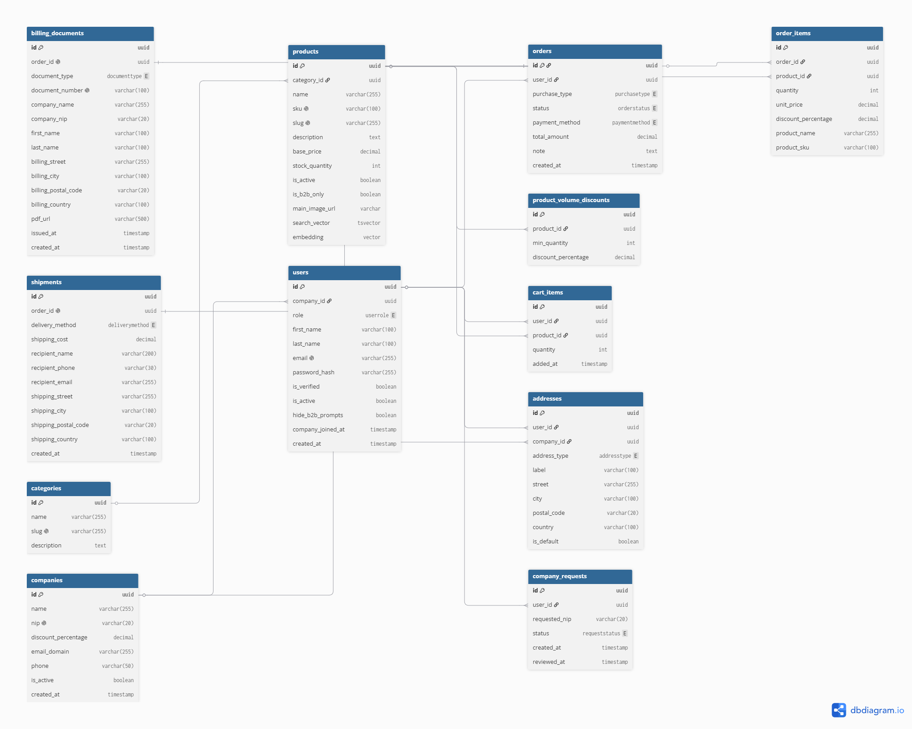

# Proxima - B2B / B2C Procurement Platform

[](https://github.com/Wikuska/Proxima-B2B-Procurement/actions/workflows/backend-ci.yml)
[](https://github.com/Wikuska/Proxima-B2B-Procurement/actions/workflows/frontend-ci.yml)


<br>

A full-stack laboratory supplies procurement platform with dual B2B / B2C purchase flows. Built with **FastAPI** and **React**.

The system features an advanced pricing engine (company and volume discounts), historical price locking on orders, invoice/billing document snapshots,
email double opt-in snd company affiliation. With a catalog browsable by everyone, including B2B-only products (purchase restricted to company accounts).

**Built solo** as a personal project to deepen backend architecture, domain modeling around immutable fiscal data,
and a production-shaped React client. 

**Workflow Evolution:** I initially started writing the codebase entirely by hand. I later integrated **Claude Code** to test agentic,
model-driven workflows, and I am currently actively experimenting with **Cursor**.

> **Note:** As the project is currently in active development, some endpoints or UI components may still be unstable or missing after local launch.

<br>

## Core Features
- **Catalog** - Browse categories and products (including B2B-only items visible to all)
- **Pricing engine** - Company discounts and volume-based tiers; quotes via API
- **Cart & checkout** - Guest cart in localStorage, authenticated cart synced with the API, multi-step checkout with frozen billing documents and line-item snapshots
- **Purchase modes** - COMPANY (B2B) vs PRIVATE (B2C), driving checkout document type
- **Mock payments** - Portfolio-friendly payment success/failure flow
- **Authentication & affiliation** - Register/login with JWT, email verification OTP, Fast Track company assignment via email domain, or join by NIP
- **User & company profile** - Orders history, personal/company addresses, members and join requests

<br>

## AI & Semantic Search

The platform features a hybrid/semantic search module using **pgvector** and a local
embedding model (`paraphrase-multilingual-MiniLM-L12-v2`).

The database is pre-seeded with vector embeddings for the demo
catalog, meaning you can test semantic search immediately upon launching the Docker
containers (no external API keys required). The embedding model is baked into the
backend image at build time.

<br>

## Planned / In Progress

**Core Platform:**
- Company dashboard tabs (overview, company-wide orders, settings)
- Platform admin panel (manage companies, catalog, users)
- Real payment provider integration and transactional email delivery
- External company registry lookup for NIP (beyond format + join workflow)
- Product image upload / object storage (replace static `public/products` files; keep `main_image_url` as source of truth)
- Regional / i18n settings in the navbar

**AI Integration:**
- Shopping-list PDF analyzer - upload a PDF list and get matched / equivalent products from the catalog
- Smart recommendations and product compatibility suggestions (build on existing related-product and embedding infrastructure)
- Catalog assistant chatbot for guided product discovery

<br>

## Screenshots





<br>

## Running with Docker

**Prerequisites:** Docker and Docker Compose must be installed.

1. Clone the repository:
```bash
git clone https://github.com/Wikuska/Proxima-B2B-Procurement.git
cd Proxima-B2B-Procurement
```

2. Start the application:
```bash
docker compose up -d --build
```

This will spin up the frontend, backend, PostgreSQL (pgvector), Redis, and pgAdmin - run migrations, seed the database with sample data, and **eager-load the local AI embedding model into memory**.

> **Note:** The initial startup may take around 60-90 seconds as the ~120MB model is loaded into RAM. Once the backend logs indicate it's ready, search queries will resolve in milliseconds.

3. Access the app:
```
Frontend UI:           http://localhost:5173
Backend API (Swagger): http://localhost:8000/docs
pgAdmin:               http://localhost:5050
```

4. Clean up:
```bash
docker compose down -v
```

### Test Credentials

Password for all seed accounts: `Password123`

In portfolio mode, email verification OTP is: `000000`

| | Email | Role |
|---|---|---|
| Admin | admin@proxima.com | Platform admin |
| B2C buyer | kowalski@gmail.com | Customer (no company) |
| Company admin | manager@acmelabs.com | Company admin (Acme Labs) |
| B2B buyer | buyer@acmelabs.com | Customer linked to company |

<br>

## Tech Stack

- **Backend:** Python 3.12, FastAPI, Uvicorn, Pydantic v2, Pytest
- **Database & ORM:** PostgreSQL 15 (pgvector), SQLAlchemy 2.0 (async), Alembic
- **Caching / verification:** Redis (OTP / verification codes)
- **Security & Authentication:** JWT (PyJWT), Argon2 (pwdlib)
- **Frontend:** React 19, Vite, React Router v7, Zustand, TanStack Query, Tailwind CSS v4, react-hook-form + Zod
- **Infrastructure:** Docker, Docker Compose, Nginx
